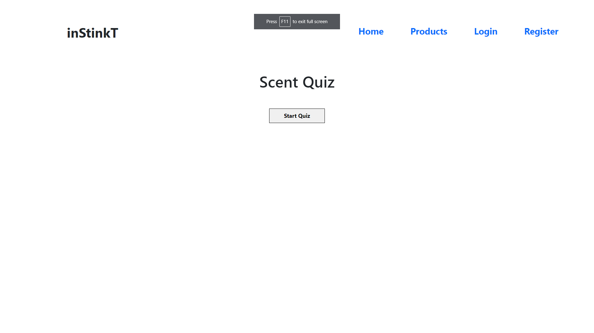
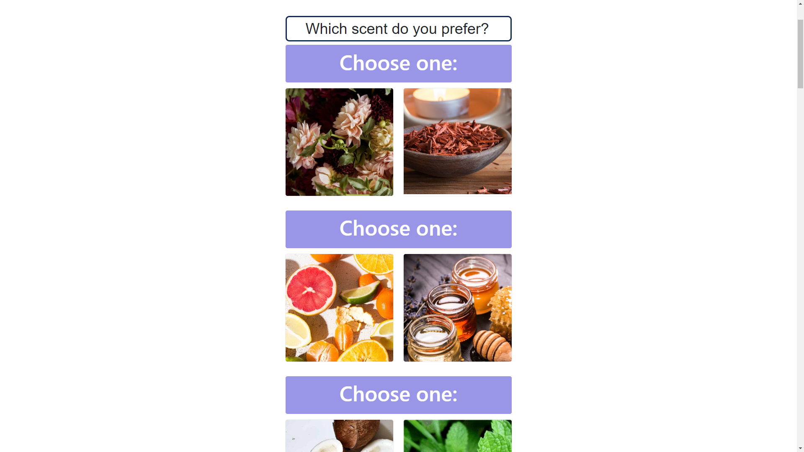
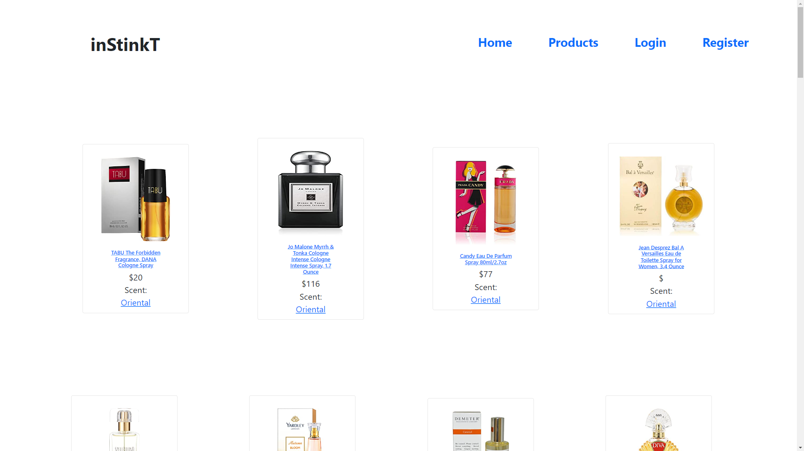

# inStinkT

## Description
A perfume-finding application. The user is able to search through perfumes based on scent type. The user also can take a quiz at the beginning of the app to determine their scent preference. Users can use the links provided with each perfume to buy them on Amazon.com.
This application utilizes ASIN Data API and Rainforest API to fetch and seed hundreds of perfume products.

## Table of Contents
* [Installation](#installation)
* [Usage](#usage)
* [License](#license)
* [Contributions](#contributions)
  

## Installation

1. clone the repo to your intended directory

2. run `npm install` in the cloned repo

3. navigate to the db directory from the terminal and run `mysqlsh -u root -p` 

4. run `source schema.sql` in the terminal

5. open the .env file in an editor and change the values to your appropriate db info

6. run `node start` in the terminal to start the server
---

## Usage

From the homepage, take our scent quiz! Click "Start Quiz" to begin.

Next, choose which scent you prefer by choosing one of the two photos displayed in each question. The quiz will determine your favorite scent type and offer a link to products that match it.

If you'd like to view all of the products available, visit our Products tab.

## Contributions
* [Jen Arboleda](https://github.com/internetjen)
* [James Ioriatti](https://github.com/jioriatti)
* [Brandon Hicks](https://github.com/bhicks927)
* [Nara Kim](https://github.com/mminted)
